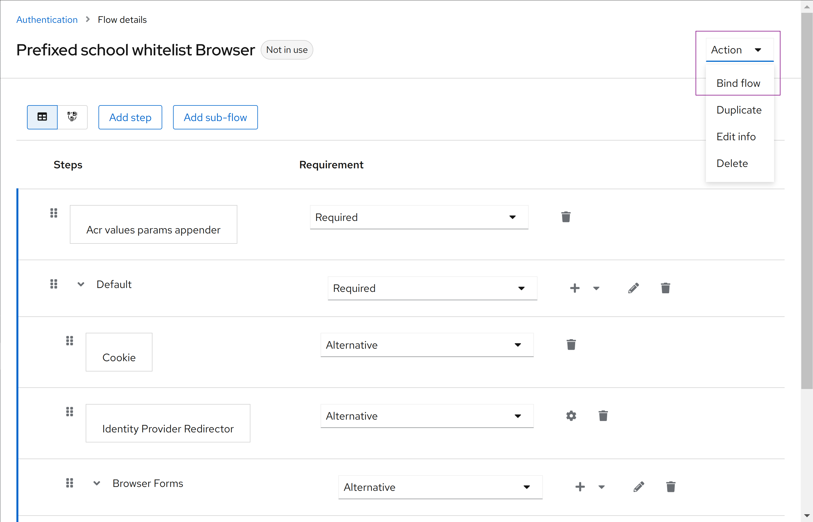

# ACR values Authenticator

## Configuration

For the ideal working of this authenticator the clients should have default values set in the advanced
tab of the client settings. Use the below steps to configure it.

Go the desired client and select the advanced tab from the list of tabs at the top

Then scroll down to the ACR to LOA mapping.

Configure the mapping as per the need but make sure to add the value to be a numeric value and key to
be a string which will be used in the default acr values section.

For more details you can refer this link: https://www.keycloak.org/docs/latest/server_admin/#_mapping-acr-to-loa-realm

You also need to configure the authenticator in the authentication flow of your choice.

In the authentication flow of your choice select the option to add authenticator

In the list of authenticator search for ACR values authenticator and select it

Add it as a required step in the authentication flow.

After adding it bind this flow as the browser flow by selecting the Action dropdown on the
top right corner of the screen and then selecting 'Bind Flow'.

Select browser flow from the dropdown list and save the authentication flow

## Behaviour

If the user tries to login to a specific client and

* the client has the default ACR values set, then the first value is set in the client session which will be added to
the IDP request as param acr_values
* the client does not have default acr values but in the OIDC auth request acr_values were requested the authenticator
checks for the values from the ACR to LOA mapping table and adds the corresponding values in the IDP request
* the client only has ACR to LOA mapping the first mapping is considered as default and passed to the IDP request
* the client has no configuration of ACR to LOA then a warning is logged

Please note that this will never set the context.failure() because this is something which is optional and not requested
by every client.
