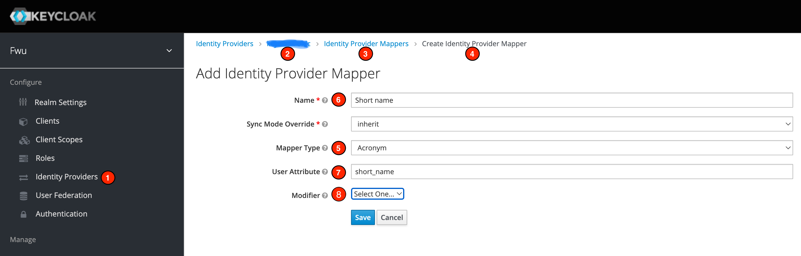

# Acronym mapper

This identity provider mapper combines the first two letters of the first and last name of a user to an acronym.

### Configuration

1. Select _Identity Providers_ in the realm menu
2. Select the identity provider that should have the mapper
3. Select the tab _Mappers_
4. Click the button _Create_
5. Select the mapper called "_Acronym_"
6. Choose a name
7. Select the user attribute to hold the acronym value
    - this will default to `acronym` if left empty
