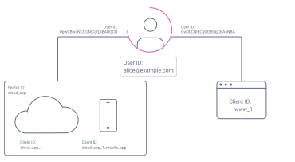

# HMAC Pairwise subject identifier

## Configuration

Prerequesite is a unique host for the redirect URIs. A client which has multiple host names configured via valid redirect URIs cannot be used for the *HMAC Pairwise subject identifier* mapper!

### Invalid example

### Valid example

Create a mapper for the desired client and enter your desired values.

1. The **Sector Identifier URI** can be used to group clients and must return a JSON array with all the hosts for the clients which use this URI.
   
2. The **Salt** is the second factor used when hashing the user ID with `SHA-256`. When no salt is configured on creation a random one will be generated.
3. Finally, the selected algorithm defines the length of the generated hash.

## How it's working

The *HMAC Pairwise subject identifier* mapper always hashes the user's ID with a host and the configured salt. This value is then mapped to the `sub` attribute in the returned token.
Meaning, when two clients have the same host and salt, they will return the same `sub` for a given user ID. 

When no Sector identifier URI is configured for the mapper, the host of the valid redirect URIs configured in the client will be used.

## Testing

The Keycloak is configured with two test users and four clients with *HMAC Pairwise subject identifier* mappers configured. The exact configuration of the mappers can be seen in the following diagram.

The clients `applicy` and `progrant` in the realm `fwu` use a *HMAC Pairwise subject identifier* mapper to pseudonymize User IDs when a token is issued. The algorithm used to pseudonymize the ID is part of the [HMAC](https://datatracker.ietf.org/doc/html/rfc2104) family - the exact algorithm can be configured for on the mapper. For validating a request, the Sector identifier URI 'http://172.18.0.2:8000/sector_identifiers.json' provided by the docker container [`sector_identifiers`](docker-compose.yaml#L20) is used.

The client `formand` also uses a *HMAC Pairwise subject identifier* mapper, but doesn't specify a Sector identifier URI. Thus the root URL of the client is used to hash the user ID.

You can use the [Postman](https://postman.io) collection '[`FWU.postman_collection.json`](FWU.postman_collection.json)' with the environment '[`FWU.postman_environment.json`](FWU.postman_environment.json)' for testing purposes:
1. `GET` the sector identifiers to see what the mapper will use
2. `GET` the user ID of a user for later
3. `POST` a login request to the `applicy` client (with sector identifier URI and salt configured)
4. `POST` a login request to the `progrant` client (with same sector identifier URI and salt configured)
5. `POST` a login request to the `formand` client (same salt - no sector identifier URI)
6. `POST` a login request to the `desight` client (different salt than `formand`, but same host configured)
7. `POST` a login request to the `applicy` client as a different user

Outcome:
1. The `sub` in the returned access tokens is not the user's ID
2. The `sub` in the access tokens returned by `applicy` and `progrant` are the same because they share the same sector identifier and salt
3. The `sub` in the access tokens returned by `applicy` and `formand` are **not** the same because the latter is not part of the sector
4. The `sub` in the access tokens returned by `formand` and `desight` are **not** the same because they don't share the same salt
5. The `sub` in the access tokens returned by `applicy` are different for each user
