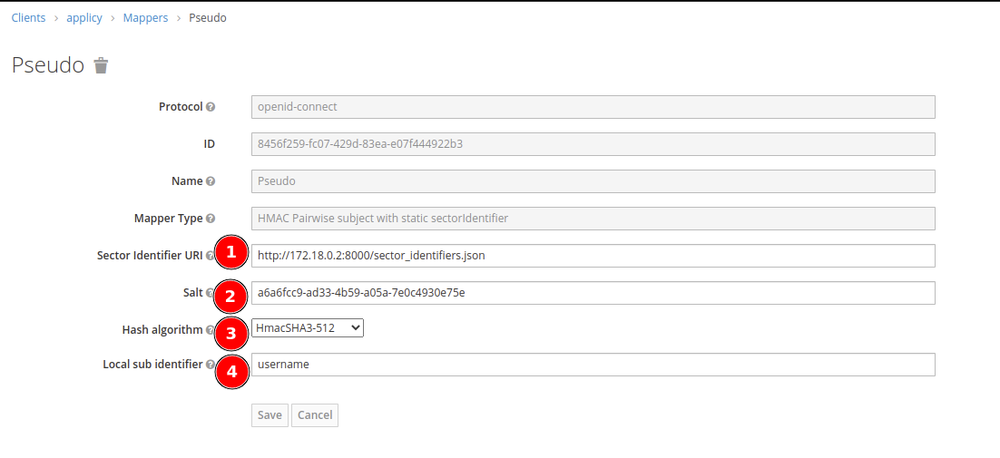
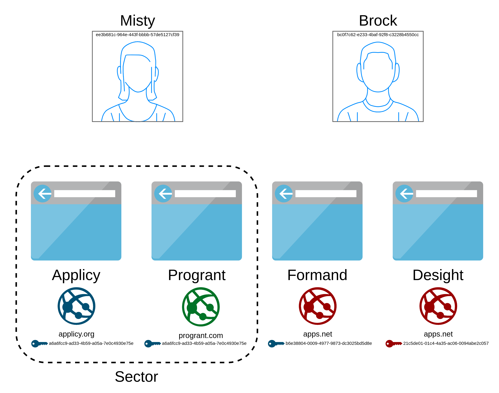

# HMAC pairwise mappers with static sectorIdentifier

There are two mappers available for pseudonymizing OIDC token claims with HMAC.

# HMAC Pairwise subject with static sectorIdentifier

This mapper sets the claim value `sub`.

## Configuration

Create a mapper for the desired client and enter your desired values.



1. New mapper *HMAC Pairwise subject with static sectorIdentifier* must be selected.
2. The Sector Identifier URI must be set to group clients.
3. The Salt is the second factor used when hashing the user ID with SHA-256. When no salt is configured on creation a random one will be generated.
4. Finally, the selected algorithm defines the length of the generated hash.
5. Local sub identifier which gives the unique identifier whose value is to be used during the pseudonymized sub generation. It should be one of the attributes of user like `id`, `username`, etc.

## How it's working

The *HMAC Pairwise subject with static sectorIdentifier* mapper always hashes the selected attribute with a host and the configured salt based on the algorithm selected. This value is then mapped to the `sub` attribute in the returned token.


## Testing

The Keycloak is configured with two test users and four clients with *HMAC Pairwise subject with static sectorIdentifier* mappers configured. The exact configuration of the mappers can be seen in the following diagram.



The clients `applicy` and `progrant` in the realm `fwu` use a *HMAC Pairwise subject with static sectorIdentifier* mapper to pseudonymize User IDs when a token is issued. The algorithm used to pseudonymize the ID is part of the [HMAC](https://datatracker.ietf.org/doc/html/rfc2104) family - the exact algorithm can be configured for on the mapper. For validating a request, the Sector identifier URI 'http://172.18.0.2:8000/sector_identifiers.json' provided by the docker container [`sector_identifiers`](docker-compose.yaml#L20) is used.

You can use the [Postman](https://postman.io) collection '[`FWU.postman_collection.json`](FWU.postman_collection.json)' with the environment '[`FWU.postman_environment.json`](FWU.postman_environment.json)' for testing purposes:
1. `GET` the sector identifiers to see what the mapper will use
2. `GET` the user ID of a user for later
3. `POST` a login request to the `applicy` client (with sector identifier URI and salt configured)
5. `POST` a login request to the `progrant` client (with same sector identifier URI and salt configured)
6. `POST` a login request to the `formand` client (with same sector identifier URI and salt configured, but different algorithm)
7. `POST` a login request to the `desight` client (with different sector identifier URI than `formand`)
8. `POST` a login request to the `applicy` client as a different user

Outcome:
1. The `sub` in the returned access tokens is not the user's ID
2. The `sub` in the access tokens returned by `applicy` and `progrant` are the same because they share the same sector identifier and salt
3. The `sub` in the access tokens returned by `applicy` and `formand` are **not** the same because the algorithm is not same for the latter
4. The `sub` in the access tokens returned by `formand` and `desight` are **not** the same because they don't share the same sector identifier
5. The `sub` in the access tokens returned by `applicy` are different for each user

# HMAC pairwise email

This mapper sets the claim value `email`.

## Configuration

The configuration doesn't differ much from the other mapper.
Only the email domain must be configured, so that the pseudo hash generated is a valid email.
Additionally, one can configure whether to override an existing email claim value.

### Examples

#### Given
1. The configured email domain "google.com"
2. The generated `sub` is `dc750843-a671-4c0d-ae94-bf2434d6f2b6`

Result:

The claim value `email` in the configured tokens will be:

```
dc750843-a671-4c0d-ae94-bf2434d6f2b6@google.com
```

#### Given
1. The email domain ist **not** configured for the mapper
2. The user's email is `example@gmail.com`
3. The generated `sub` is `dc750843-a671-4c0d-ae94-bf2434d6f2b6`

Result:

The claim value `email` in the configured tokens will be:

```
dc750843-a671-4c0d-ae94-bf2434d6f2b6@gmail.com
```

#### Given
1. The email domain ist **not** configured for the mapper
2. The user's email is **not** set
3. The generated `sub` is `dc750843-a671-4c0d-ae94-bf2434d6f2b6`

Result:

The claim value `email` in the configured tokens will be:

```
dc750843-a671-4c0d-ae94-bf2434d6f2b6
```

# HMAC pairwise pseudonym list mapper

This mapper sets a configurable claim containing a map of pseudonyms for configured clients. The pseudonyms are 
generated using the "HMAC Pairwise subject with static sectorIdentifier" mapper using the original configuration 
of the clients configured mapper.

## Configuration
### Select Mapper

Create a mapper for the desired client of type List of HMAC Pairwise subject with static sectorIdentifier


### Configure Mapper

- Name:       Name of the mapper shown in the client's mapper list
- Clients:    comma or ## separated List of Clients which pseudonym should be added to the claim.
    ```
    Client must have a HMAC Pairwise subject with static sectorIdentifier configured otherwise config is rejected
    If a client gets removed later at users login a message is logged that the client does not exist anymore and the pseudonym for it is not included in the claim.
    ```
- Name of the claim which should contain the pseudonym list
    ```
    If there is already a claim with that name of type map, then the pseudonyms are added to that claim.
    If the existing claim is not a map the mapper will fail.
    ```
- Tokens where the claim should be included


## Testing

To verify if the pseudonyms are added you can use the postman collection like for the test for the HMAC Pairwise Mapper. 

- Login into a client which has the new pseudonym list mapper configured.
- Copy token which the claim got included to. e.g. access token verify it with e.g. jwt.io to contain new claim


