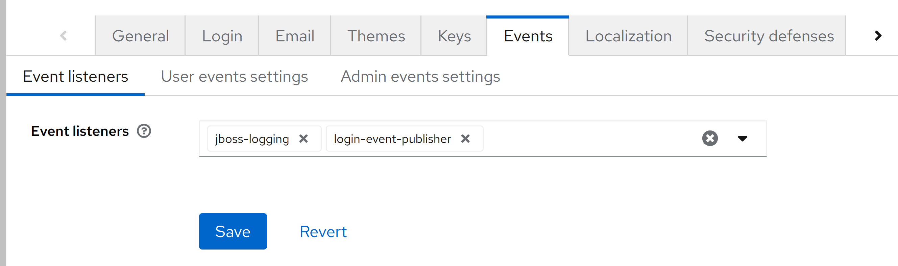

# Login event publisher

This extension listens to the LOGIN event in the Keycloak. After successfully listening the event it publishes the contents of the events to the RabbitMQ.

## Configurations

### Attribute containing SchoolIds

To be able to read the school ids from the correct user attribute you have to define an environment variable with the
name `KC_SPI_EVENTS_LISTENER_LOGIN_EVENT_PUBLISHER_SCHOOLIDS_ATTRIBUTE` and the value of the user-attribute to read the
schoolids from.

### Custom listener

To configure this event listener please configure the custom event listener in Keycloak as show in the image below.

### Prerequisites

This extension depends on the Rabbitmq for publishing the event messages in the queue. Moreover, it also has a consumer spring boot application which is present on the gitlab repository.