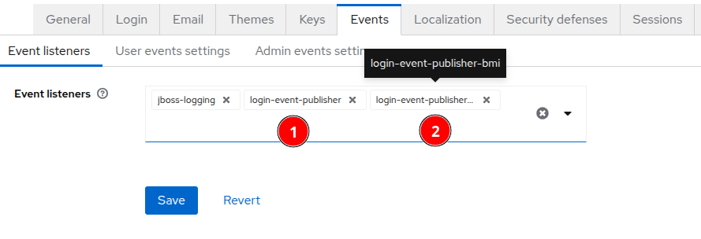

# Login event publisher

This extension listens to the LOGIN event in the Keycloak. After successfully listening the event it publishes the contents of the events to the RabbitMQ.

## Prerequisites

This extension depends on the Rabbitmq for publishing the event messages in the queue. Moreover, it also has a consumer spring boot application which is present on the gitlab repository.

## Deployment

### Environment variables

The following environment variables or system properties can be set on the deployment.

| Name                                                         | Description                                                  | Default value    |
| ------------------------------------------------------------ | ------------------------------------------------------------ | ---------------- |
| `KC_SPI_EVENTS_LISTENER_LOGIN_EVENT_PUBLISHER_RMQ_HOST` / `KC_SPI_EVENTS_LISTENER_LOGIN_EVENT_PUBLISHER_BMI_RMQ_HOST` | Hostname of the RabbitMQ to publish the events to.           | `localhost`      |
| `KC_SPI_EVENTS_LISTENER_LOGIN_EVENT_PUBLISHER_RMQ_VHOST` / `KC_SPI_EVENTS_LISTENER_LOGIN_EVENT_PUBLISHER_BMI_RMQ_VHOST` | Virtual host of the RabbitMQ to publish the events to.       | `/`              |
| `KC_SPI_EVENTS_LISTENER_LOGIN_EVENT_PUBLISHER_RMQ_PORT` / `KC_SPI_EVENTS_LISTENER_LOGIN_EVENT_PUBLISHER_BMI_RMQ_PORT` | Port of the RabbitMQ to publish the events to.               | `5672`           |
| `KC_SPI_EVENTS_LISTENER_LOGIN_EVENT_PUBLISHER_RMQ_USERNAME` / `KC_SPI_EVENTS_LISTENER_LOGIN_EVENT_PUBLISHER_BMI_RMQ_USERNAME` | Username to authenticate to RabbitMQ with.                   | `guest`          |
| `KC_SPI_EVENTS_LISTENER_LOGIN_EVENT_PUBLISHER_RMQ_PASSWORD` / `KC_SPI_EVENTS_LISTENER_LOGIN_EVENT_PUBLISHER_BMI_RMQ_PASSWORD` | Password to authenticate to RabbitMQ with.                   | `guest`          |
| `KC_SPI_EVENTS_LISTENER_LOGIN_EVENT_PUBLISHER_RMQ_EXCHANGE` / `KC_SPI_EVENTS_LISTENER_LOGIN_EVENT_PUBLISHER_BMI_RMQ_EXCHANGE` | RabbitMQ exchange name.                                      | `login-details`  |
| `KC_SPI_EVENTS_LISTENER_LOGIN_EVENT_PUBLISHER_BMI_RMQ_ROUTING_KEY` | RabbitMQ routing key. :warning: No effect on listener `login-event-publisher`! | `KC.EVENT.LOGIN` |
| `KC_SPI_EVENTS_LISTENER_LOGIN_EVENT_PUBLISHER_RMQ_SSL_ENABLED` / `KC_SPI_EVENTS_LISTENER_LOGIN_EVENT_PUBLISHER_BMI_RMQ_SSL_ENABLED` | Whether to enable SSL for `amqps` protocol or not.           | `false`          |
| `KC_SPI_EVENTS_LISTENER_LOGIN_EVENT_PUBLISHER_SCHOOLIDS_ATTRIBUTE` / `KC_SPI_EVENTS_LISTENER_LOGIN_EVENT_PUBLISHER_BMI_SCHOOLIDS_ATTRIBUTE` | User attribute name to fetch school IDs from.                |                  |

## Configuration

You can enable any of the custom event listeners in Keycloak realms settings Events tab as shown in the image below.

