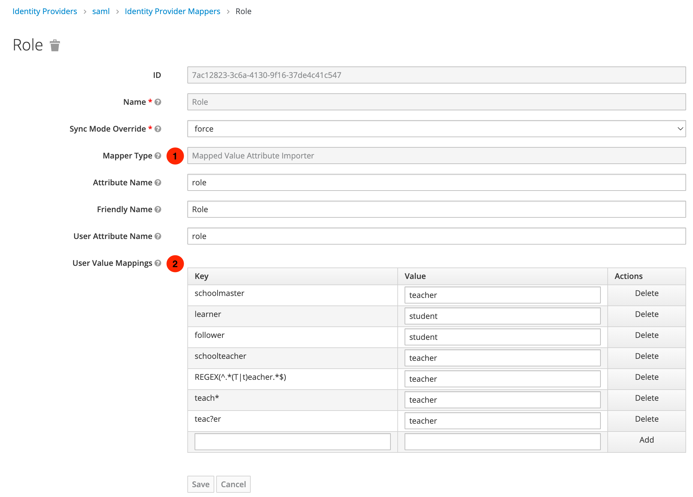
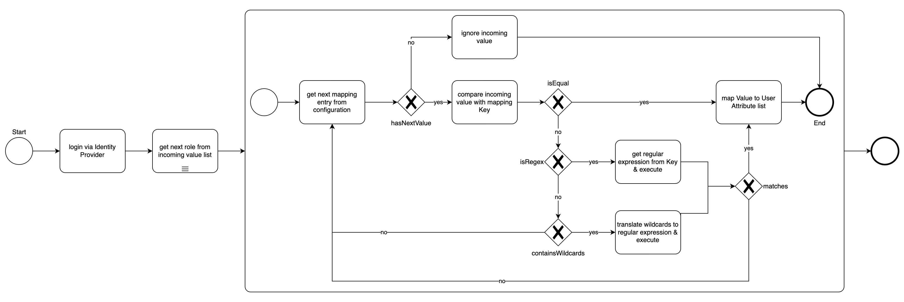

# Mapped Value Attribute Importer

This is an extension of the existing **Attribute Importer** mapper to translate the incoming attribute values in addition.
 It supports SAML- and OIDC- Identity Providers.

## Configuration

Create a mapper for the Identity Provider and enter your desired values.

1. Custom mapper *Mapped Value Attribute Importer* must be selected.
2. User attribute value mappings has to be configured

### Three types of "User Value Mappings"

`Key` = incoming attribute (saml) or claim (oidc) value

`Value` = outgoing (translated) user attribute value

| Type           | Description                                                                                                      | Example                                                      |
|----------------|------------------------------------------------------------------------------------------------------------------|--------------------------------------------------------------|
| exact match    | `Key` is compared via equal()-operator against the incoming value                                                | `Key` = "follower" `Value` = "student"                       |
| wildcard match | `Key` contains wildcards (*/?) and is interpreted as a regular expression that must match the incoming value | `Key` = "teach*" `Value`= "teacher"                          |
| regex match    | `Key` is marked as regular expression "REGEX(\<expression\>)" and must match the incoming value              | `Key` = "REGEX(^.\*(T&#124;t)eacher.\*$)" `Value`= "teacher" |

## Mapping Logic

**Hint:** If there is no mapping (key/value) entry configured or none of the keys match, the incoming value will be **ignored**.  