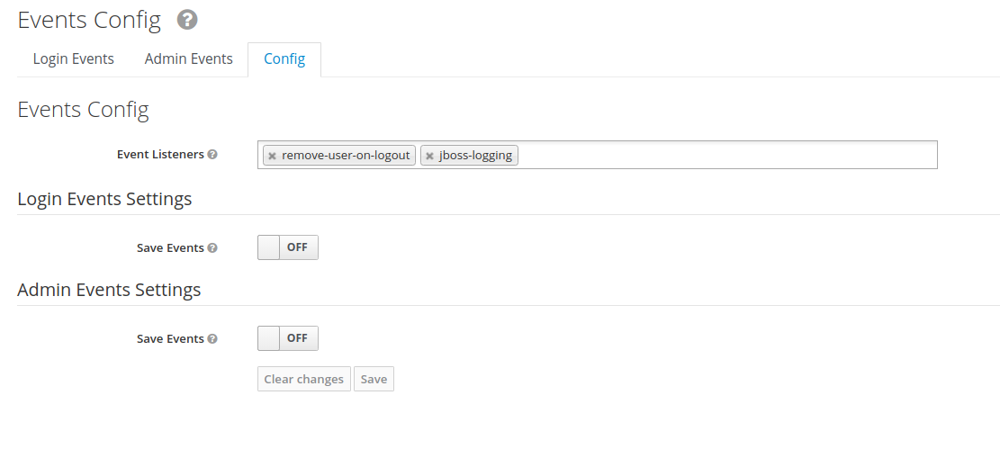
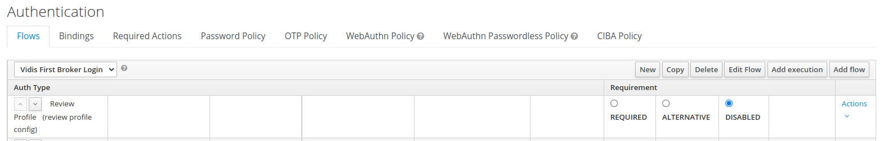
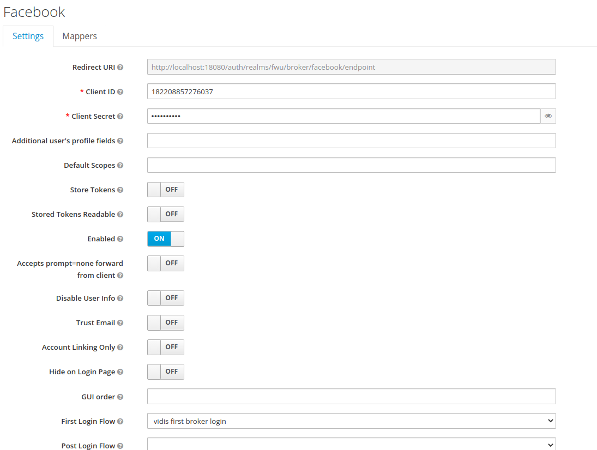

# Remove user on logout

This extension is to make sure the user is removed from keycloak on the user logout and session expiration.

Moreover, with the recent development before removing the user the licence associated with the user is released.

## Configurations

### Custom listener

Remove user on logout event listener should be configured to enable the removal of the user on logout.



You can also configure if only IDP-Users(IDP) are deleted or all users (ALL) by setting an environment Variable. Default is no User get's deleted.
```shell
KC_SPI_EVENTS_LISTENER_REMOVE_USER_ON_LOGOUT_<REALM>: [IDP|ALL|NONE]
```
The rest API URL to release the licence associated with the user can be configured using the following environments.
```shell
KC_SPI_EVENTS_LISTENER_REMOVE_USER_ON_LOGOUT_LICENCE_URL: http://mockserver:1080/v1/licences/release
KC_SPI_EVENTS_LISTENER_REMOVE_USER_ON_LOGOUT_LICENCE_API_KEY: sample-api-key
```
### Custom authentication flow

Custom authentication flow should be configured to disable the profile review like below,

1. Open **Realm settings**  > **Authentication** > **Flows**.
2. Select the `First  Boker Lgin` and copy
3. In the copy, disable `Review Profile(review profile config)`

 

### IDP configuration

Any idp configured should use the copied flow as first login flow like below,

 


### Custom rest api endpoint

A special REST-API endpoint has been provided to delete users whose session has timed out.
When this endpoint is called, all users who do not have an active session (OFFLINE session is ignored) and have a link to an IdP are deleted.
The maximum number of data records to be deleted can be specified as a query parameter (limited to 1000 data records)

https://<keycloak-host>/auth/admin/realms/<realm-name>/vidis-custom/users/inactive?max={numberOfUserToDelete}
e.g. https://keycloak-test.ded/auth/admin/realms/test/users/inactive?max=500

Like on the event-listener, you can also configure if only IDP-Users(IDP) are deleted or all users (ALL) by setting an environment Variable. Default is no User get's deleted.

By default only Users which have been created earlier then 30 seconds ago are deleted. This can be configured by setting the environment variable `KC_SPI_ADMIN_REALM_RESTAPI_EXTENSION_VIDIS_CUSTOM_<REALM>` to `IDP`, `ALL` or `NONE`.
```shell
KC_SPI_ADMIN_REALM_RESTAPI_EXTENSION_VIDIS_CUSTOM_<REALM>: [IDP|ALL|NONE]
KC_SPI_ADMIN_REALM_RESTAPI_EXTENSION_VIDIS_CUSTOM_DELETIONTOLERANCE: [TIME IN SECONDS]
```