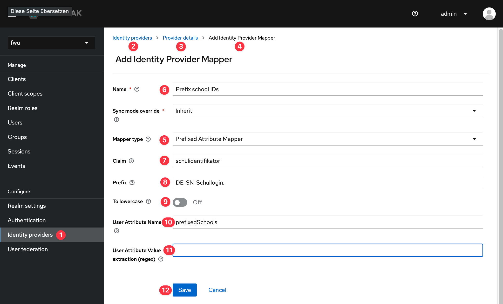

# Prefixed attribute mapper

This identity provider mapper can be used to add a prefix to claim values when mapping them to a user attribute.
The claim can be single- or multi-valued. In case of multi-valued all values are prefixed.

## Example use-case

Teachers can reference the school they're working at via a school ID.
Because it is possible for a teacher to work at multiple schools, this attribute is multi-valued.
Unfortunately these school IDs are not globally unique; only per organization (identity provider).
For this reason the school IDs have to be prefixed with a value that is unique for this identity provider when they're logging in.

## Configuration



1. Select _Identity Providers_ in the realm menu
2. Select the identity provider that should have the mapper
3. Select the tab _Mappers_
4. Click the button _Create_
5. Select the mapper called "_Prefixed Attribute Mapper_"
6. Choose a name
7. Select the claim the school IDs are delivered in
8. Set a prefix you want to add to the school ID value(s)
9. Select whether you want the prefixed value(s) to be transformed to lower case
10. Select the user attribute to store the prefixed value(s)
11. Click the button _Save_

Now this configured attribute can be used in the custom authentication flow for _First Broker Login_.
There the [_Whitelist Authenticator For Schools_](../whitelist-authenticator-schools/README.md) has to be configured with the user attribute selected above.


The service behind _Whitelist URI_ has to return the `listOfSchools` with the prefix.
For example:

```json
...
{
  "spAlias": "taskforce",
    "listOfSchools": [
      "DE-SN-Schullogin.8171",
      "DE-SN-Schullogin.912",
      "DE-SN-Schullogin.421"
    ]
}
...
```
