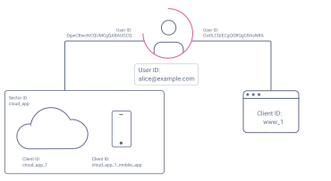
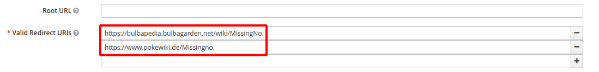

# Setup for testing

Run the script `start_for_testing.sh` in the root directory to start the Keycloak.
This will start a Keycloak docker container and others specified in the [`docker-compose.yaml`](docker-compose.yaml).

## Pairwise subject identifier

The clients `slowpoke` and `drowzee` in the realm `fwu` use a *Pairwise subject identifier* mapper to pseudonymize User IDs when a token is issued. For validating a request, the Sector identifier URI 'http://172.18.0.2:8000/sector_identifiers.json' provided by the docker container [`sector_identifiers`](docker-compose.yaml#L20) is used.

The client `grimer` also uses a *Pairwise subject identifier* mapper, but doesn't specify a Sector identifier URI. Thus the root URL of the client is used to hash the user ID.

### How it's working

The *Pairwise subject identifier* mapper always hashes the user's ID with a host and the configured salt. This value is then mapped to the `sub` attribute in the returned token. 
Meaning, when two clients have the same host and salt, they will return the same `sub` for a given user ID. 

When no Sector identifier URI is configured for the mapper, the host of the valid redirect URIs configured in the client will be used.

> :warning: A client which has multiple host names configured via valid redirect URIs cannot be used for the *Pairwise subject identifier* mapper!

### Testing

You can use the [Postman](https://postman.io) collection '[`FWU.postman_collection.json`](FWU.postman_collection.json)' with the environment '[`FWU.postman_environment.json`](FWU.postman_environment.json)' for testing purposes:
1. `GET` the sector identifiers to see what the mapper will use
2. `GET` the user ID of a user for later
3. `POST` a login request to the `slowpoke` client
4. `POST` a login request to the `drowzee` client
5. `POST` a login request to the `grimer` client
6. `POST` a login request to the `slowpoke` client as a different user

Outcome:
1. The `sub` in the returned access tokens is not the user's ID
2. The `sub` in the access tokens returned by `slowpoke` and `drowzee` are the same because they share the same sector identifier and salt
3. The `sub` in the access tokens returned by `slowpoke` and `grimer` are **not** the same because the latter is not part of the sector
4. The `sub` in the access tokens returned by `slowpoke` are different for each user