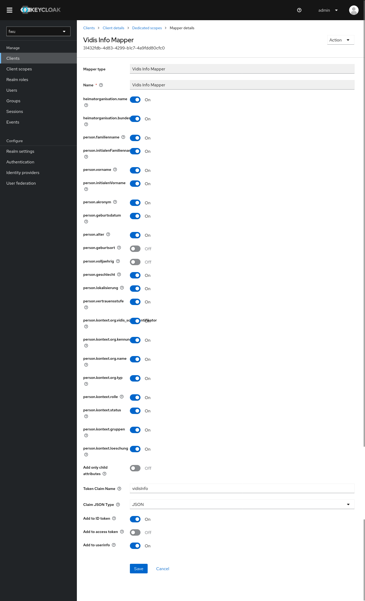
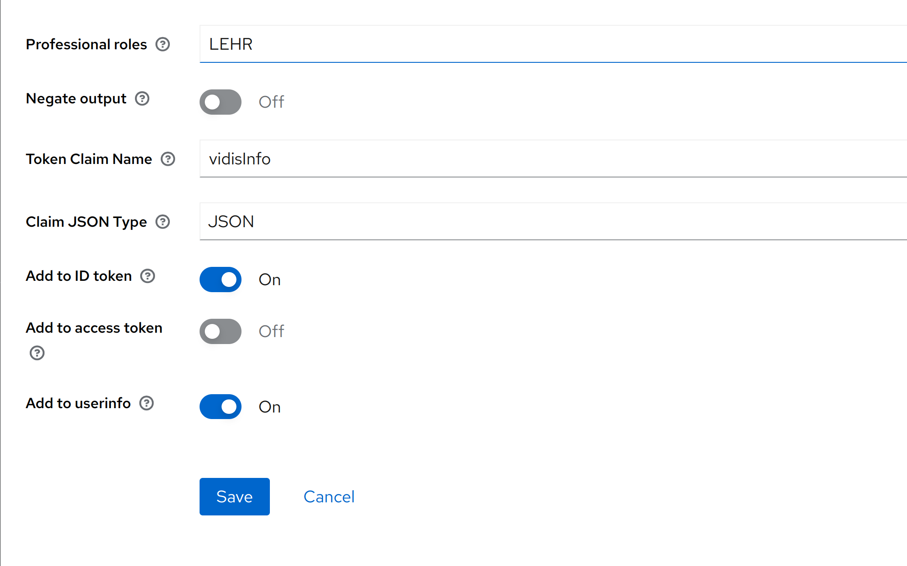
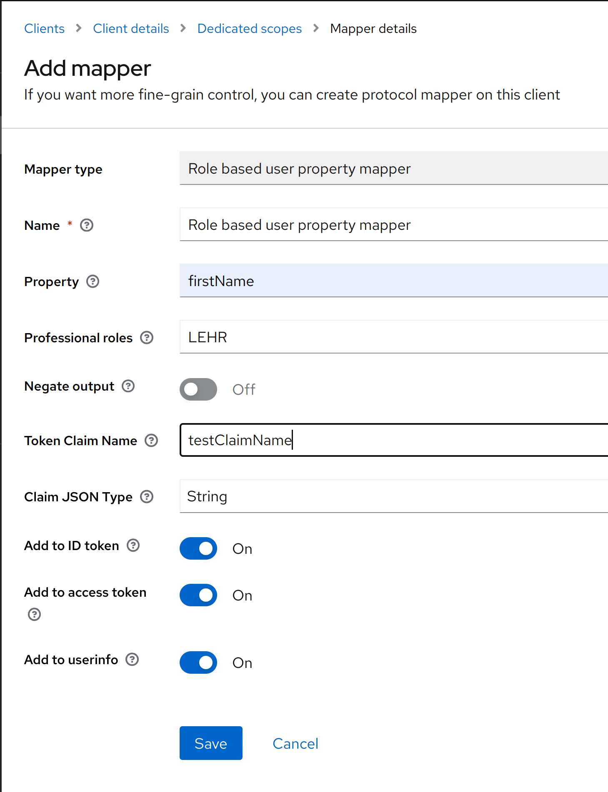

# Vidis Info Mapper
Service Provider Mapper, which reads standard metadata attributes from user and adds them to the token.
Output is a standardized userInfo JSON-Structure.

## Input
This mapper uses the following standardized user attributes as an input:
[user-info-api](./../user-info-api/README.md)

## Configuration
If a Service Provider supports processing users metadata, a new mapper has to be configured for it.
1. Go to "Clients" and select the client to configure
2. Go to Tab "Mappers" and click on Button "create" adding a new mapper
3. Select "Vidis Info Mapper" as mapper type
4. De-/Activate fields based on the data privacy agreement
5. Set "Token Claim Name" for the metada data JSON structure
6. Define which token should contain this data



## Output
This mapper produces the following standardized metadata JSON-structure
[user-info-api](./../user-info-api/README.md)

### Example JSON - Users metadata
```json
{
  "version": "1.0.0",
  "pid": "d3febc7d-14ed-323f-b361-34d07527cdc0",
  "heimatorganisation": {
    "id": "DE-SN-Schullogin",
    "name": "Schulischer Anmeldeservice Musterstadt",
    "bundesland": "DE-BY"
  },
  "person": {
    "name": {
      "familienname": "Muster",
      "vorname": "Max",
      "akronym": "mamu",
      "initialenFamilienname": "M",
      "initialenVorname": "M"
    },
    "geburt": {
      "datum": "2010-01-01",
      "alter": "12",
      "volljaehrig": "NEIN",
      "geburtsort": "Ostfildern, Deutschland"
    },
    "geschlecht": "D",
    "lokalisierung": "de-DE",
    "vertrauensstufe": "VOLL"
  },
  "personenkontexte": [
    {
      "id": "af3a88fc-d766-11ec-9d64-0242ac120002",
      "organisation": {
        "orgid": "15685758-d18e-49c1-a644-f9996eb0bf08",
        "kennung": "NI_12345",
        "name": "Muster-Schule",
        "typ": "SCHULE",
        "vidis_schulidentifikator": "de-sn-schullogin.ni_12345"
      },
      "rolle": "LERN",
      "personenstatus": "AKTIV",
      "gruppen": [
        {
          "gruppe": {
            "id": "ab34d607-b950-41a5-b69d-80b8812c224a",
            "mandant": "02feb60dc3f691af4a4bf92410fac8292bb8e7d6adebb70b2a65d3c35d825d8a",
            "orgid": "02feb60dc3f691af4a4bf92410fac8292bb8e7d6adebb70b2a65d3c35d825d8a",
            "referrer": "fe4e50cb-c148-4156-8c2f-dc5260b267cf",
            "bezeichnung": "Englisch, 2. Klasse",
            "thema": "Thema",
            "beschreibung": "Beschreibung der Gruppe",
            "typ": "SONSTIG",
            "bereich": "WAHL",
            "optionen": [
              "01",
              "02"
            ],
            "differenzierung": "G",
            "bildungsziele": [
              "GS"
            ],
            "jahrgangsstufen": [
              "JS_02"
            ],
            "faecher": [
              {
                "code": "EN"
              }
            ],
            "referenzgruppen": [
              {
                "id": "21252996-7a5d-47b5-9c62-c416460908f0",
                "rollen": [
                  "LERN",
                  "LEHR"
                ]
              }
            ],
            "laufzeit": {
              "von": "2023-08-01",
              "bis": "2024-01-31",
              "sichtfreigabe": "JA"
            },
            "revision": "1"
          },
          "gruppenzugehoerigkeit": {
            "rollen": [
              "LEHR"
            ]
          }
        }
      ],
      "loeschung": {
        "zeitpunkt": "2099-12-31T23:59Z"
      }
    },
    {
      "id": "af3a88fc-d766-11ec-9d64-0242ac112345",
      "organisation": {
        "orgid": "15685758-d18e-49c1-a644-f9996e12345",
        "kennung": "0972",
        "name": "Gymnasium",
        "typ": "SCHULE",
        "vidis_schulidentifikator": "de-sn-schullogin.0972"
      },
      "rolle": "LEHR",
      "personenstatus": "AKTIV",
      "loeschung": {
        "zeitpunkt": "2099-12-31T23:59Z"
      }
    }
  ]
}
```

## Configuration based on role

### Terminologies
1. Professional role: It is the role which is associated to the person. For example, a person who is signing in the system
can be a teacher, student, principal of the school or admin of the school. One person can have multiple roles. This role
which is associated with the person is stored as a user attribute in one of the following keys: rolle, person.kontext.rolle
and person.kontext.<number>.rolle.
2. Negate output: Apply a NOT to the check result of roles. When this is true, then the condition will evaluate to true 
just if user does NOT have the specified role present in the user attributes. When this is false, the condition will evaluate
to true just if user has the specified role.

### Overview
There is now a possibility to hide the person.name tag in the token claim [User Metadata](#Output) based on the role of 
the user. If this needs to be used please add the professional roles which need to be checked in the mapper. There is also
an option to use negate output feature which will just negate the output after checking the roles.



# Role based info Mapper

Service Provider Mapper similar to the user property mapper provided by Keycloak, which reads provided property from the
user attribute based on the role which is assigned to the user and adds them to the token. Role is checked in the following
user attributes : rolle, person.kontext.rolle, person.kontext.<number>.rolle.

## Input
This mapper uses the following standardized user attributes for roles as an input:
[user-info-api](./../user-info-api/README.md)

## Configuration
If a Service Provider supports processing users metadata, a new mapper has to be configured for it.
1. Go to "Clients" and select the client to configure
2. Go to Tab "Mappers" and click on Button "create" adding a new mapper
3. Select "Role based user property mapper" as mapper type
4. Add the professional roles to be checked in the user attributes
5. Also select if the output should be negated or not [Negate Output](#Terminologies)
6. Set "Token Claim Name" for the meta-data JSON structure
7. Define which token should contain this data



### Example JSON - Users metadata

#### Case 1

If the user has the following attributes:


Mapper is configured as follows:


Output claim would be as follows:
```json
{
  "exp": 1715356637,
  "iat": 1715356337,
  "auth_time": 0,
  "jti": "911d8277-4e55-4e8e-a528-760425b00a05",
  "iss": "http://localhost:18080/auth/realms/fwu",
  "aud": "role-based-mapping-test",
  "sub": "95e4ea82-c643-4300-b96d-04e88506490b",
  "typ": "ID",
  "azp": "role-based-mapping-test",
  "session_state": "93da8cc0-8d18-453c-b5dc-2f5d7bea0c27",
  "acr": "1",
  "sid": "93da8cc0-8d18-453c-b5dc-2f5d7bea0c27",
  "email_verified": false,
  "name": "idp user",
  "preferred_username": "idpuser",
  "testClaimName": "idp",
  "given_name": "idp",
  "family_name": "user",
  "email": "idpuser@test.de"
}
```
In the above example testClaimName corresponds to the firstName of the user.

#### Case 2

If the user has the following attributes:


Mapper is configured as follows:


Output claim would be as follows:
```json
{
  "exp": 1715969875,
  "iat": 1715969575,
  "auth_time": 0,
  "jti": "fb6cb852-5334-49ab-b00d-fdfd66a47e1c",
  "iss": "http://localhost:18080/auth/realms/fwu",
  "aud": "role-based-mapping-test",
  "sub": "63ee98a0-7710-479e-b4e9-54efe3884ef9",
  "typ": "ID",
  "azp": "role-based-mapping-test",
  "session_state": "9049f4b0-5fb8-4f06-a713-69b7ffb785f7",
  "acr": "1",
  "sid": "9049f4b0-5fb8-4f06-a713-69b7ffb785f7",
  "email_verified": false,
  "name": "idp user",
  "preferred_username": "idpuser",
  "given_name": "idp",
  "family_name": "user",
  "email": "idpuser@test.de"
}
```
In the above example testClaimName is not mapped as negate output was selected.