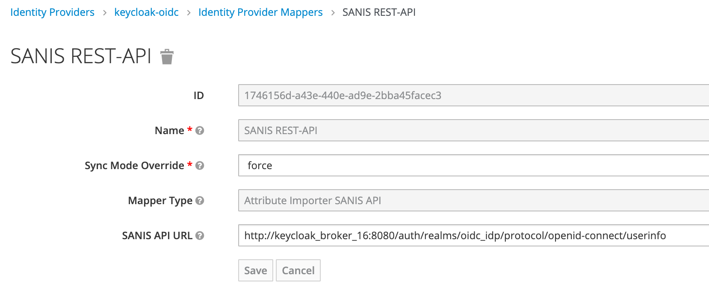

# Attribute Importer SANIS API

This attribute importer calls the IdPs SANIS endpoint and stores user metadata into standardized user attributes.

## Input-/Ouput mapping
| Input - SANIS                           | Output - Standardized User Attribute                 |
|:----------------------------------------|:-----------------------------------------------------|
| N/A                                     | heimatorganisation.bundesland                        |
| person.name.familienname                | person.familienname                                  |
| person.name.vorname                     | person.vorname                                       |
| N/A                                     | person.akronym                                       |
| person.name.initialenVorname            | person.initialenVorname                              |
| person.name.initialenFamilienname       | person.initialenFamilienname                         |
| person.geburt.datum                     | person.geburtsdatum                                  |
| person.geschlecht                       | person.geschlecht                                    |
| person.lokalisierung                    | person.lokalisierung                                 |
| person.vertrauensstufe                  | person.vertrauensstufe                               |
| personenkontexte[].ktid                 | person.kontext.<number>.id                           |
| personenkontexte[].organisation.orgid   | person.kontext.<number>.org.id                       |
| personenkontexte[].organisation.kennung | person.kontext[<number>].org.kennung                 |
| N/A                                     | person.kontext.<number>.org.vidis_schulidentifikator |
| personenkontexte[].organisation.name    | person.kontext[<number>].org.name                    |
| personenkontexte[].organisation.typ     | person.kontext[<number>].org.typ                     |
| personenkontexte[].rolle                | person.kontext[<number>].rolle                       |
| personenkontexte[].personenstatus       | person.kontext[<number>].status                      |
| personenkontexte[].loeschung            | person.kontext[<number>].loeschung                   |
| personenkontexte[].gruppen[]            | person.kontext[<number>].gruppen[]                   |

## Configuration
If an IdP provides the SANIS "/personInfo"-Endpoint, a mapper can be configured to retrieve and store this
data into standardized user attributes.
1. Go to "Identity Providers" and select the IdP to configure
2. Go to Tab "Mappers" and click on Button "create" adding a new mapper
3. Select "Attribute Importer SANIS API" as mapper type
4. Enter the SANIS "personInfo" endpoint URL

