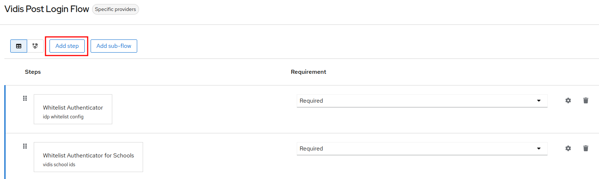
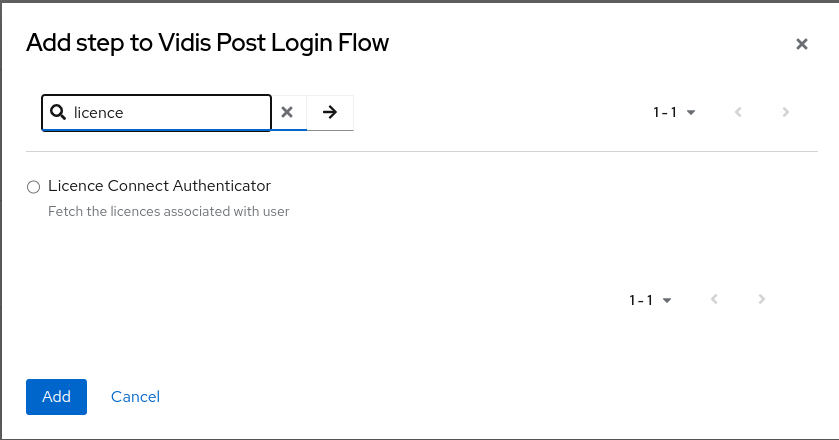
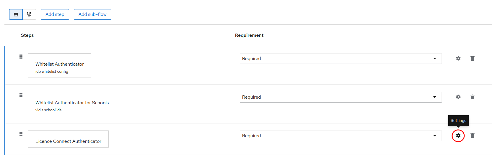
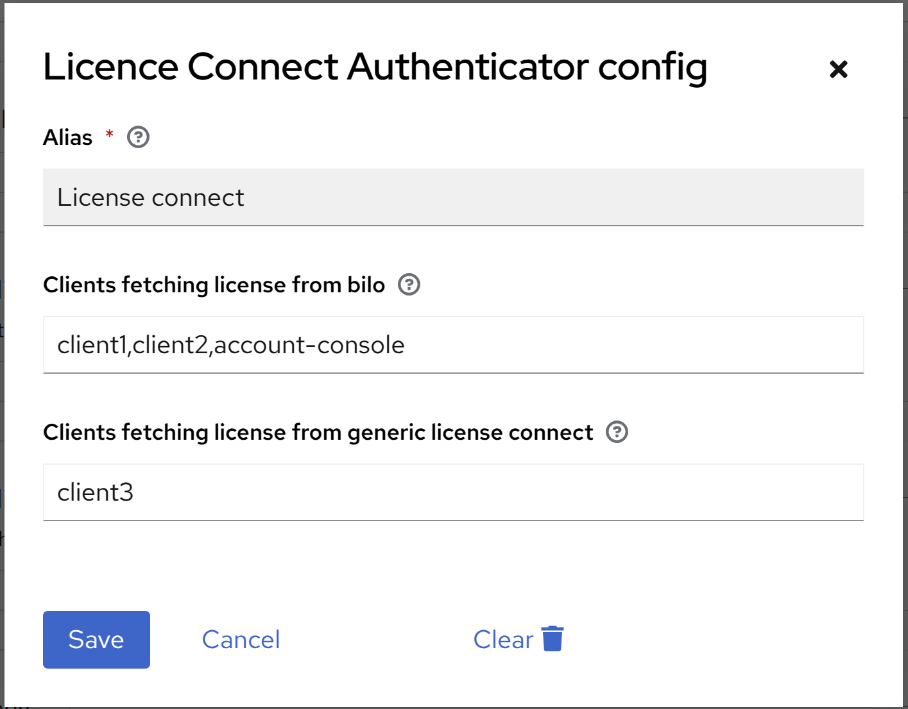
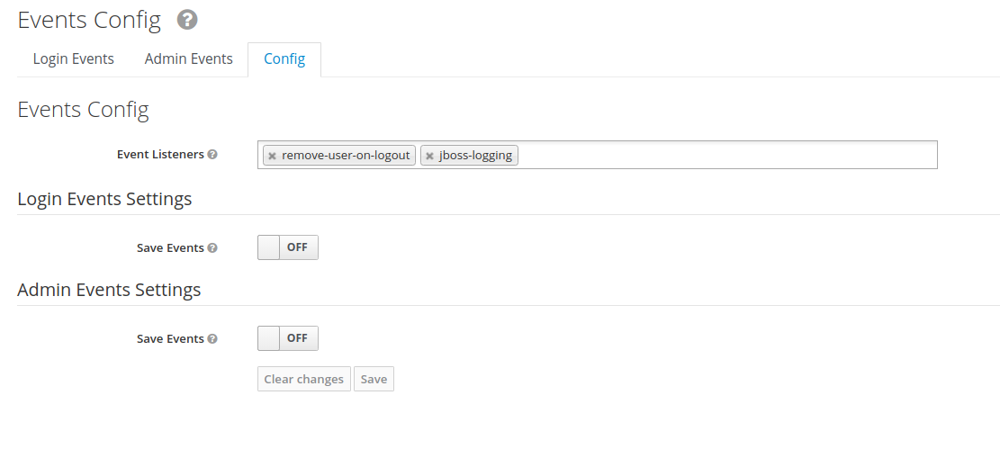
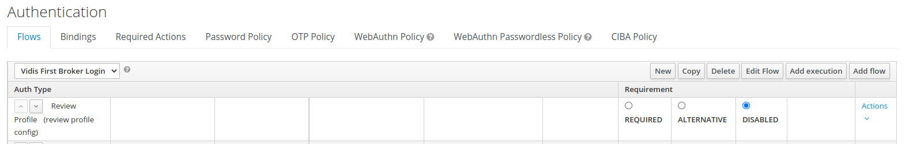
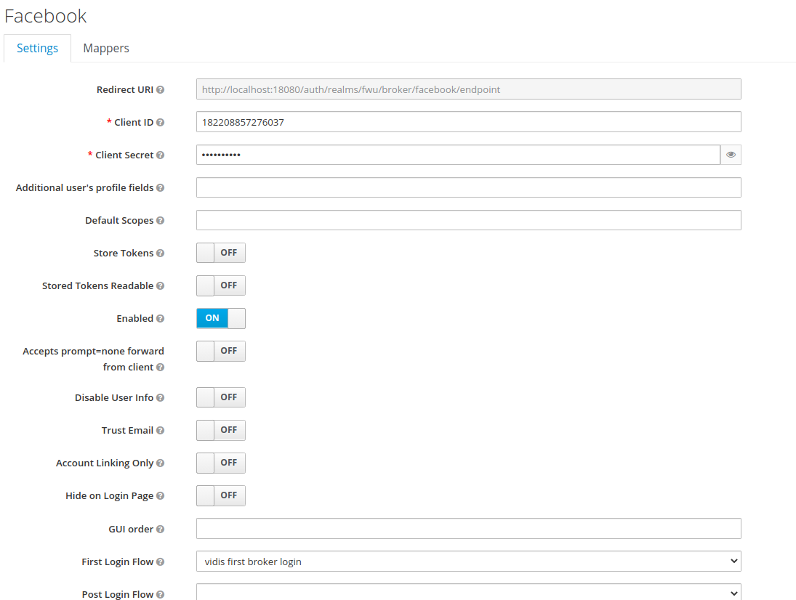

# User Licence Lifecycle Manager

This extension handles the lifecycle of users and licences. It consists of two main features:

- Licence Connect Authenticator, which fetches the licence from [Licence Connect](https://licenceconnect.schule/)  
  when a user logs in via idp. The licence is then persisted
  together with the 'hmacId'
- Remove User On Logout, which deletes the Keycloak user once it logs out and sends a release request to Licence Connect.
  Furthermore, the licence is deleted from the database

## Licence Connect Authenticator

### Configuration

#### Rest endpoint in UI

The following variables must be set within the Admin UI for the authenticator config.

In the authentication flow of your choice select the option to add authenticator



In the list of authenticator search for Licence Connect Authenticator and select it



After selecting it make it to be required and then click on the settings symbol near the authenticator



Once the dialog box is opened configure the URL to fetch the licence and the sample key which is needed for
authentication



#### Fetching the user licence

The licence associated with user is managed by a [Licence Connect](https://licenceconnect.schule/), 
which provides endpoints to gather those information.

**Endpoint:** <hostname>/v1/licences/request

Request body

```json
{
  "userId": "02e71a9d-d68d-3050-9a0d-5b963c06aec0",
  "clientId": "Angebot12345",
  "schulkennung": "DE-MV-SN-51201",
  "bundesland": "DE-MV"
}
```

Response body

```json
{
  "hasLicences": true,
  "licences": [
    {
      "license_code": "VHT-9234814-fk68-acbj6-3o9jyfilkq2pqdmxy0j"
    },
    {
      "license_code": "COR-3rw46a45-345c-4237-a451-4333736ex015"
    }
  ]
}
```

### Behaviour

#### Reading of configuration

The mentioned REST-Endpoint will be called during each login.

#### Permitting or denying

If the user tries to login to a specific client and

* the user has licence associated and returned as response in the REST-API then the login is  _permitted_ and attribute
  named `licence` is added to the user.
  Additionally, the licence is persisted with the `hmacID` being the primary key. The `hmacID` is created by the
  clients [HMAC Mapper](../hmac-mapper/README.md "hmac-mapper")
* the user does not have licence associated and REST-API returns 404,500 or non successful response then the login is
  not _permitted_.

## Remove user on logout

In this part, we make sure the user is removed from keycloak on the user logout and session expiration.

Moreover, before removing the user the licence associated with the user is released in
Licence Connect and deleted from the Keycloak database.

### Configurations

#### Custom listener

Remove user on logout event listener should be configured to enable the removal of the user on logout.



You can also configure if only IDP-Users(IDP) are deleted or all users (ALL) by setting an environment Variable. Default
is no User get's deleted.

```shell
KC_SPI_EVENTS_LISTENER_REMOVE_USER_ON_LOGOUT_<REALM>: [IDP|ALL|NONE]
```

The rest API URL to release the licence associated with the user can be configured using the following environments.

```shell
KC_SPI_EVENTS_LISTENER_REMOVE_USER_ON_LOGOUT_LICENCE_URL: http://mockserver:1080/v1/licences/release
KC_SPI_EVENTS_LISTENER_REMOVE_USER_ON_LOGOUT_LICENCE_API_KEY: sample-api-key
```

#### Custom authentication flow

Custom authentication flow should be configured to disable the profile review like below,

1. Open **Realm settings**  > **Authentication** > **Flows**.
2. Select the `First  Boker Lgin` and copy
3. In the copy, disable `Review Profile(review profile config)`

 

#### IDP configuration

Any idp configured should use the copied flow as first login flow like below,

 

#### Custom rest api endpoint

A special REST-API endpoint has been provided to delete users whose session has timed out.
When this endpoint is called, all users who do not have an active session (OFFLINE session is ignored) and have a link
to an IdP are deleted.
The maximum number of data records to be deleted can be specified as a query parameter (limited to 1000 data records)

https://<keycloak-host>/auth/admin/realms/<realm-name>/vidis-custom/users/inactive?max={numberOfUserToDelete}
e.g. https://keycloak-test.ded/auth/admin/realms/test/users/inactive?max=500

Like on the event-listener, you can also configure if only IDP-Users(IDP) are deleted or all users (ALL) by setting an
environment Variable. Default is no User get's deleted.

By default only Users which have been created earlier then 30 seconds ago are deleted. This can be configured by setting
the environment variable `KC_SPI_ADMIN_REALM_RESTAPI_EXTENSION_VIDIS_CUSTOM_<REALM>` to `IDP`, `ALL` or `NONE`.

```shell
KC_SPI_ADMIN_REALM_RESTAPI_EXTENSION_VIDIS_CUSTOM_<REALM>: [IDP|ALL|NONE]
KC_SPI_ADMIN_REALM_RESTAPI_EXTENSION_VIDIS_CUSTOM_DELETIONTOLERANCE: [TIME IN SECONDS]
```

## Testing

1. Build the jar with

```
mvn package -DskipTests
```

2. Start the containers for the mockserver and the firefox standalone with

```
docker compose -f test/docker-compose.yaml up --detach
```

3. Run the tests with

```
mvn verify
```

4. Stop the docker containers

```
docker compose -f test/docker-compose.yaml down
```
