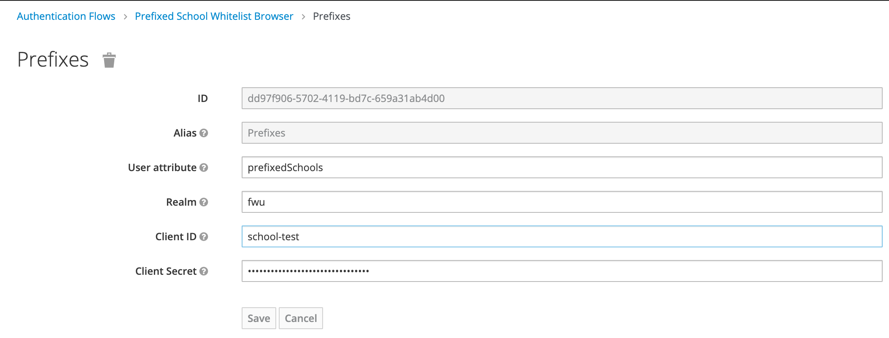

# Whitelist Authenticator Schools

## Configuration

### Preparing a schools whitelist (JSON)

The Whitelist must be stored as a simple JSON-File on a HTTP-Server.

**Structure:**

List of JSON-Objects having two attributes
1. `spAlias`: Service Provider Alias from Keycloak client configuration
2. `listOfSchools`: JSON-Array with School IDs

**Example:**
```
[
    {
        "spAlias": "client01",
        "listOfSchools": ["817","912"]
    },
    {
        "spAlias": "client02",
        "listOfSchools": ["817","912","421"]
    }
]
```

### Execution step Configuration



| Field                            | Description                                                                           |
|----------------------------------|---------------------------------------------------------------------------------------|
| User attribute                   | User attribute which contains the school ID information send by the Identity Provider |
| Whitelist URI                    | Reference to the Whitelist configuration file (JSON format)                           |
| Cache refresh Interval (minutes) | Defines the refresh interval for the internal whitelist configuration cache           |

### Authentication Flow Configuration


1. Copy or modify existing Authentication Flow
2. Add new execution step with `Add Execution` button
3. Select `Whitelist Authenticator For Schools` Provider
3. Configure Provider via `Actions -> Config`
4. Add execution step to the very end and set it to `REQUIRED`

## Behaviour

### Reading of configuration

The mentioned JSON file will be loaded on the first access or the first attempt to login using this authenticator. So the first login will have to wait until it is loaded.

On every subsequent attempt to login it will check whether the refresh interval has timed out already. In that case the JSON file is reloaded asynchronously, so the login does not have to wait, but any updates of the file will be available in the near future.

### Permitting or denying

#### Corrupt configuration

If the configuration can not be loaded initially, either because the URI is not valid, the server is not responding or the JSON structure is invalid, every login will be denied.

If the configuration could be loaded at least once, but was modified in an invalid way afterwards, the last valid configuration will be kept and used.

#### Correct configuration

If the user tries to login to a specific client and

* the client is  _not_  configured in the JSON file then the login is  _denied_ .
* the client  _is_  configured and its list of school ids contains the special marker `AllowAll` (case sensitive) then the login is  _permitted_ .
* the client  _is_  configured with a (possibly empty) list of school ids and
    - the user has no school id at all or no school id matching any of the configured ids then the login is  _denied_ .
    - the user has at least one school id which matches any of the configured school ids for that client then the login is  _permitted_ .