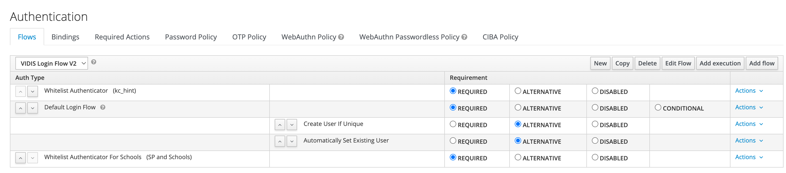

# Whitelist Authenticator Schools

## Configuration


### SPI environment variables

The following environment variables must be set within the deployment pipeline.

| Property                                                        | Description                                                        | Example                                                    |
|-----------------------------------------------------------------|--------------------------------------------------------------------|------------------------------------------------------------|
| KC_SPI_AUTHENTICATOR_SCHOOL_WHITELIST_AUTHENTICATOR_KC_AUTH_URL | Keycloak auth URI                                                  | http://keycloak:8080/auth                                  |
| KC_SPI_AUTHENTICATOR_SCHOOL_WHITELIST_AUTHENTICATOR_REST_URL    | Whitelist REST endpoint (path variables must be replaced with '%s' | http://mockserver:1080/service-provider/%s/idp-assignments |

### Preparing a schools whitelist

The Whitelist configuration will be managed by a microservice, which provides endpoints to gather those information.

**Endpoint:** <hostname>/school-assignments?serviceProvider=`Client-ID`&idpId=`IdP alias`

```json
{
  "allowAll": false,
  "vidisSchoolIdentifiers": [
    "DE-MV-12345"
  ]
}
```

### Execution step Configuration


| Field          | Description                                                                                                                                     |
|----------------|-------------------------------------------------------------------------------------------------------------------------------------------------|
| User attribute | User attribute which contains the school ID information send by the Identity Provider                                                           |
| Realm          | Specifies the name of the realm that contains the configured client for the REST API. If no value is specified, then the current realm is used. |
| Client ID      | REST-API Client ID from Keycloak                                                                                                                |
| Client Secret  | REST-API Secret from Keycloak                                                                                                                   |

### Authentication Flow Configuration



1. Copy or modify existing Authentication Flow
2. Add new execution step with `Add Execution` button
3. Select `Whitelist Authenticator For Schools` Provider
3. Configure Provider via `Actions -> Config`
4. Add execution step to the very end and set it to `REQUIRED`

## Behaviour

### Reading of configuration

The mentioned REST-Endpoint will be called during each login.

### Permitting or denying

#### Corrupt configuration

If the configuration can not be loaded, either because the credential are not valid, the server is not responding or the response structure is invalid, every login will be denied.

#### Correct configuration

If the user tries to login to a specific client and

* the client is  _not_  configured in the REST-API then the login is  _denied_ .
* the client  _is_  configured and the configuration contains the special flag `"allowAll": "true"` then the login is  _permitted_ .
* the client  _is_  configured with a (possibly empty) list of school ids and
    - the user has no school id at all or no school id matching any of the configured ids then the login is  _denied_ .
    - the user has at least one school id which matches any of the configured school ids for that client then the login is  _permitted_ .