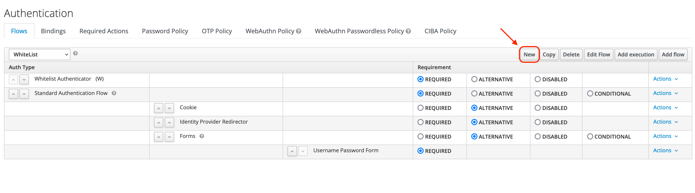
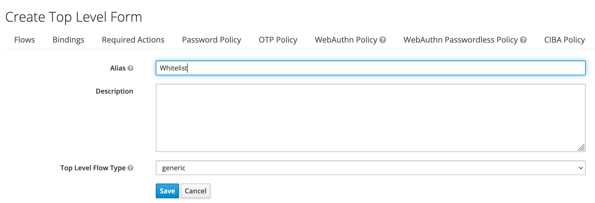
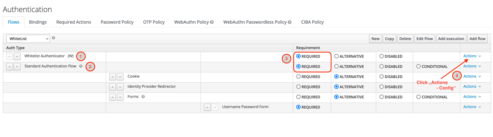
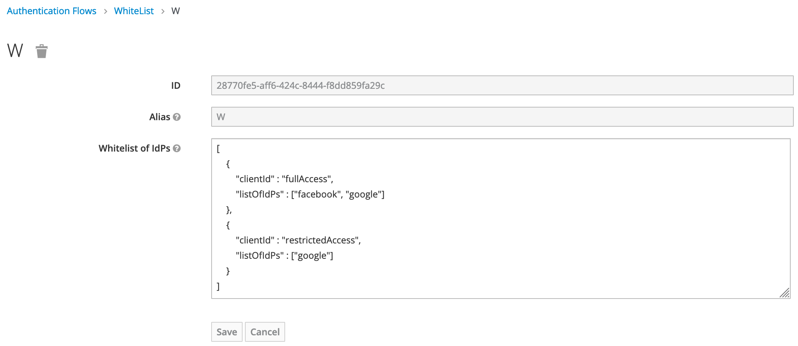

# POC - Whitelist Authenticator

Authenticator extension which rejects authentication if client does not match a white list from selected IdP.

## Configuration

### Preparing a whitelist (JSON)

To simplify the proof of concept, the whitelist will be stored as a simple JSON-Structure in a custom config property inside the Authenticator.

**Structure:**

List of JSON-Objects having two attributes
1. `clientId`: Client ID from Keycloak client configuration
2. `listOfIdPs`: JSON-Array with Identity Provider alias

**Example:**
```
[
{ "clientId" : "fullAccess", "listOfIdPs" : ["facebook", "google"]},
{ "clientId" : "restrictedAccess", "listOfIdPs" : ["google"]}
]
```
### Set up a new authentication flow

First step of the new authentication flow will be our new `Whitelist Authenticator` followed by a flow step for the standard authentication procedure. 

**1. Click Button "Create" to create a new flow**



**2. Enter an `Alias`** for the new top level flow and click save



**3. Configure the new flow**



1. Click Button `Add execution` and select `Whitelist Authenticator` as a `Provider`
2. Click Button `Add flow` to create "standard" browser flow
3. Mark both workflow steps as `REQUIRED`
4. Click `Actions -> Config` to set up the whitelist (see picture below)
5. Add all other workflow steps for your authentication



## How it's working

The `Whitelist Authenticator` is searching for a special query parameter `KC_IDP_HINT`.
- If this parameter is present, then the provider checks it against the whitelist together with the client ID.
- If not, then this workflow step will be skipped.

## Testing

The clients `fullAccess` and `restrictedAccess` in the realm `whitelist` use a custom authentication flow `WhiteList` to test the new `Whitelist Authenticator`.

You can use the [Postman](https://postman.io) collection '[`FWU_whitelist.postman_collection.json`](./../test/FWU_whitelist.postman_collection.json)' with the environment '[`FWU.postman_environment.json`](./../test/FWU.postman_environment.json)' for testing purposes:
1. `GET` to login with client_id=`fullAccess` and kc_idp_hint=`facebook`
2. `GET` to login with client_id=`restrictedAccess` and kc_idp_hint=`facebook`

Outcome:
1. User will be forwarded to the browser login page, because the combination of `client_id` and `kc_idp_hint` is valid
2. User will get an error page, because the combination of `client_id` and `kc_idp_hint` is invalid (restrictedAccess is only configured for IdP=google)

