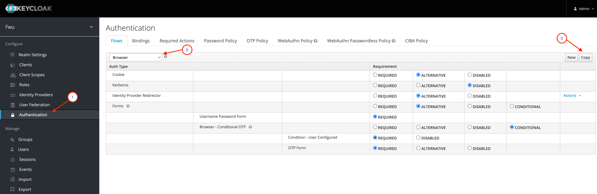
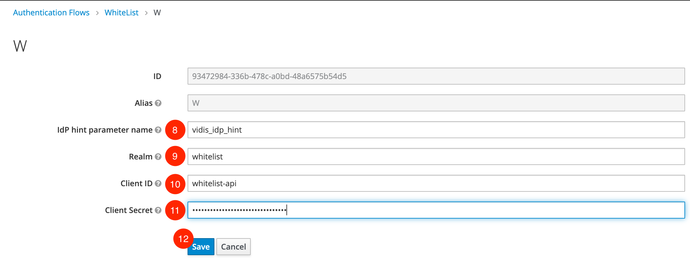
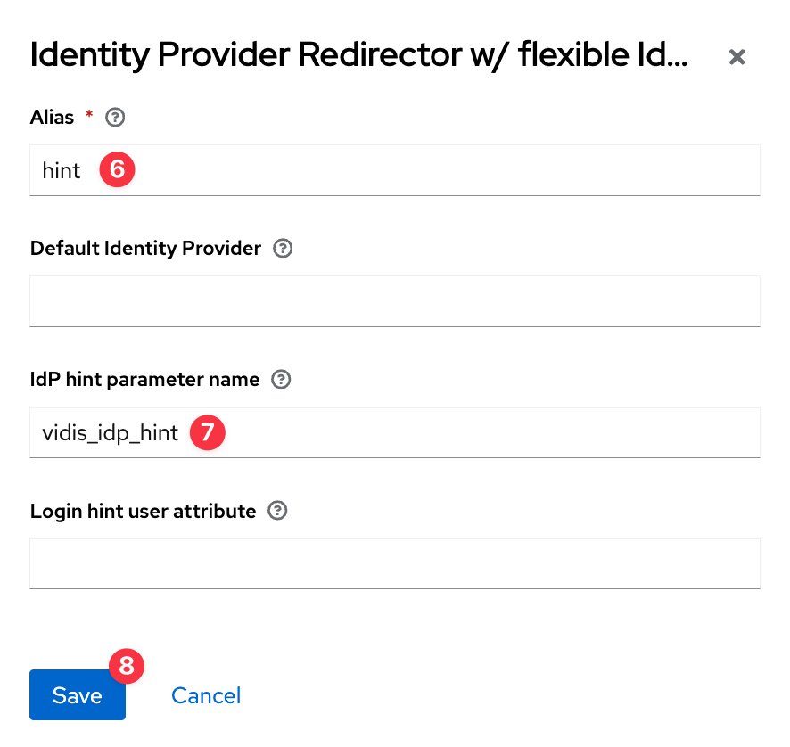

# Whitelist Authenticator

Authenticator extension which rejects authentication if client does not match a white list from selected IdP.

## Configuration

### Setting the IdP hint parameter name

The parameter for selecting the IdP (default: `kc_idp_hint`) can be configured in the authenticator config.


If the configuration is missing or doesn't contain the configured parameter, the authenticator will look for the parameter 'kc_idp_hint'.

### Preparing a whitelist (JSON)

The Whitelist will be stored as a simple JSON-Structure in a custom config property inside the Authenticator.

**Structure:**

List of JSON-Objects having two attributes
1. `clientId`: Client ID from Keycloak client configuration
2. `listOfIdPs`: JSON-Array with Identity Provider alias

**Example:**
```
[
{ "clientId" : "fullAccess", "listOfIdPs" : ["facebook", "google"]},
{ "clientId" : "restrictedAccess", "listOfIdPs" : ["google"]}
]
```
### Set up a new authentication flow

First step of the new authentication flow will be our new `Whitelist Authenticator` followed by a flow step for the standard authentication procedure. 
The following steps are valid for "Browser" and "First Broker Login" authentication flow.

**Step 1. Copy existing authentication flow**



1. Click on "Authentication" under "Configure" section from left sidebar tree
2. Select Authentication flow template, which should be extended
3. Click Button `Copy` to create a copy of this flow


4. Enter a name for the new flow
5. Click Button `Save` to save your changes

**Step 2. Add new execution step and configure it**


1. Click Button `Add execution`


2. Select `Whitelist Authenticator` as a `Provider`
3. Click Button `Save` to save your changes


4. Mark workflow step as `REQUIRED`
5. Move workflow step to the very top by clicking on the `up arrow` button


6. Click Link `Actions`
7. Choose `Config` entry



8. Overwrite the parameter name for the IdP hint if needed
9. Enter whitelist (JSON-Structure)
10. Click Button `Save` to save your changes

**Step 3: Configure IdP hint parameter name for identity provider authenticator**

*This step is not needed, when IdP hint parameter name is default 'kc_idp_hint'!*

1. Select 'Add execution' on the authentication flow
2. look for provider 'Identity Provider Redirector W/ Flexible IdP Hint'


3. Move the flexible redirector up to the original one
4. Delete the original authenticator


5. Click on 'Actions' > 'Config' to edit the configuration
6. Set an alias
7. Enter the query parameter name that should be used for IdP redirection
8. Hit 'Save'



**Step 4: Set authentication flow as default**

**Option 1:** Browser Flow


1. Select customized authentication flow under (`Bindings`tab)
2. Click Button `Save` to save your changes

**Option 2:** First Broker Login Flow


1. Select Identity Provider to configure ("Configure" section from left sidebar tree)
2. Choose tab `Settings`
3. Select customized authentication flow and save your work

## How it's working

### Browser Flow
The `Whitelist Authenticator` is searching for a special query parameter which is configurable (default: `kc_idp_hint`).
- If this parameter is present, then the provider checks it against the whitelist together with the client ID.
- If not, then this workflow step will be skipped.

### First Broker Login Flow
The `Whitelist Authenticator` is searching for a selected Identity Provider inside the brokered context.
- If this information is present, then the provider checks it against the whitelist together with the client ID.
- If not, then this workflow step will be skipped.

## Testing

The clients `fullAccess` and `restrictedAccess` in the realm `whitelist` use a custom authentication flow `WhiteList` to test the new `Whitelist Authenticator`.

You can use the [Postman](https://postman.io) collection '[`FWU_whitelist.postman_collection.json`](./../test/FWU_whitelist.postman_collection.json)' with the environment '[`FWU.postman_environment.json`](./../test/FWU.postman_environment.json)' for testing purposes:
1. `GET` to login with client_id=`fullAccess` and kc_idp_hint=`facebook`
2. `GET` to login with client_id=`restrictedAccess` and kc_idp_hint=`facebook`

Outcome:
1. User will be forwarded to the browser login page, because the combination of `client_id` and `kc_idp_hint` is valid
2. User will get an error page, because the combination of `client_id` and `kc_idp_hint` is invalid (restrictedAccess is only configured for IdP=google)

